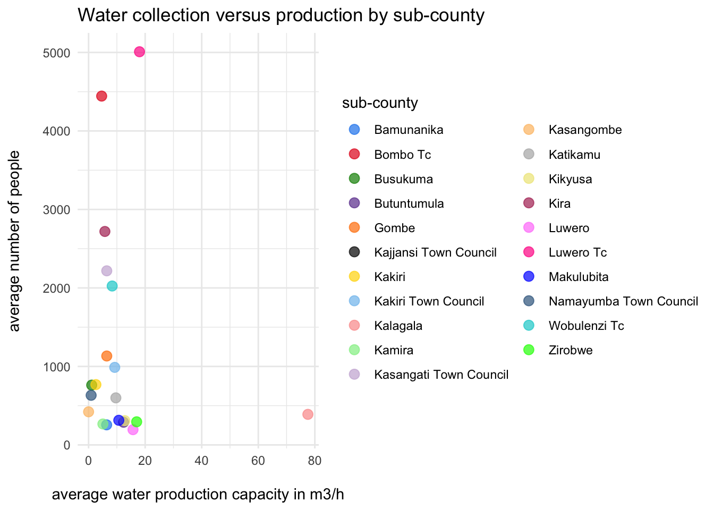

<!-- README.md is generated from README.Rmd. Please edit that file -->

# ugabore

<!-- badges: start -->

[](https://creativecommons.org/licenses/by/4.0/)

<!-- badges: end -->

The goal of `ugabore` is to provide users with documentation on borehole
repair data collected from two districts in central Uganda where a
borehole operation and maintenance program is run. The dataset is
associated with the following [project
report](https://ds4owd-001.github.io/project-ljc3084/) completed by
Joseph Lwere for the “data science for openwashdata” course.

## Installation

You can install the development version of ugabore from
[GitHub](https://github.com/) with:

``` r
# install.packages("devtools")
devtools::install_github("openwashdata/ugabore")
```

Alternatively, you can download the individual datasets as a CSV or XLSX
file from the table below.

| dataset | CSV                                                                                       | XLSX                                                                                        |
|:--------|:------------------------------------------------------------------------------------------|:--------------------------------------------------------------------------------------------|
| ugabore | [Download CSV](https://github.com/openwashdata/ugabore/raw/main/inst/extdata/ugabore.csv) | [Download XLSX](https://github.com/openwashdata/ugabore/raw/main/inst/extdata/ugabore.xlsx) |

## Project goal

Boreholes are the main technology used to access groundwater in Uganda,
according to (Owor et al. 2022), and they are also a source of drinking
water for households in rural communities in Africa, including Uganda
(Lapworth et al. 2020). Therefore, it is crucial to have good quality
data to inform decision-making and planning. This project examines data
collected from two districts in central Uganda where a borehole
operation and maintenance program is run. As professional operation and
maintenance is considered the future for borehole functionality in
Uganda (Smith, Ongom, and Davis 2023), this project report offers more
insights into research on this topic.

## Data

The dataset includes information about borehole repair records used by
the borehole operation and maintenance company operating in central
Uganda. The package provides access to one dataset.

``` r
library(ugabore)
```

The `ugabore` data set has 10 variables and 173 observations. For an
overview of the variable names, see the following table.

<table class="table table-striped" style="margin-left: auto; margin-right: auto;">
<thead>
<tr>
<th style="text-align:left;">
variable_name
</th>
<th style="text-align:left;">
variable_type
</th>
<th style="text-align:left;">
description
</th>
</tr>
</thead>
<tbody>
<tr>
<td style="text-align:left;">
community
</td>
<td style="text-align:left;">
character
</td>
<td style="text-align:left;">
Local name used to refer to the administrative unit 5 where the borehole
is located.
</td>
</tr>
<tr>
<td style="text-align:left;">
parish
</td>
<td style="text-align:left;">
character
</td>
<td style="text-align:left;">
Local name used to refer to the administrative unit 4 where the borehole
is located.
</td>
</tr>
<tr>
<td style="text-align:left;">
sub_county
</td>
<td style="text-align:left;">
character
</td>
<td style="text-align:left;">
Local name used to refer to the administrative unit 3 where the borehole
is located.
</td>
</tr>
<tr>
<td style="text-align:left;">
source_id
</td>
<td style="text-align:left;">
character
</td>
<td style="text-align:left;">
Unique identification number assigned to the borehole by the borehole
maintenance company.
</td>
</tr>
<tr>
<td style="text-align:left;">
repair_date
</td>
<td style="text-align:left;">
double
</td>
<td style="text-align:left;">
Most recent repair date of the borehole.
</td>
</tr>
<tr>
<td style="text-align:left;">
population_served
</td>
<td style="text-align:left;">
double
</td>
<td style="text-align:left;">
Number of people that collect water from the borehole.
</td>
</tr>
<tr>
<td style="text-align:left;">
well_depth
</td>
<td style="text-align:left;">
double
</td>
<td style="text-align:left;">
Total depth of the borehole (measured in meters).
</td>
</tr>
<tr>
<td style="text-align:left;">
static_water_depth
</td>
<td style="text-align:left;">
double
</td>
<td style="text-align:left;">
Depth of the stable water level within the borehole when pumping isn’t
happening (measured in meters).
</td>
</tr>
<tr>
<td style="text-align:left;">
pump_installation_depth
</td>
<td style="text-align:left;">
double
</td>
<td style="text-align:left;">
Depth of the pump when installed from land surface (measured in meters).
</td>
</tr>
<tr>
<td style="text-align:left;">
well_yield
</td>
<td style="text-align:left;">
double
</td>
<td style="text-align:left;">
Water production capacity of the borehole (measured in m3/h).
</td>
</tr>
</tbody>
</table>

## Example: Water production capacity versus number of people collecting

Here is a basic example illustrating the relationship between the number
of people collecting water from boreholes in a sub-county and the water
production capacity of the corresponding boreholes. From the plot, we
see that the sub-county of Kalagala has the highest water production
capacity by far. However, it is not the sub-county that serves the most
people, suggesting it may be the richest one. On another note, the
sub-counties Bombo Town Council and Luwero Town Council have the most
people collecting water from their boreholes but do not have high water
production capacity, indicating a need for improvement.

``` r
library(ugabore)
library(ggplot2)
library(dplyr)

# Define custom colors for plotting
custom_colors <- c(
  "Bamunanika" = "dodgerblue2", "Bombo Tc" = "#E31A1C",
  "Busukuma" = "green4",
  "Butuntumula" = "#6A3D9A",
  "Gombe" = "#FF7F00", 
  "Kajjansi Town Council" = "black", "Kakiri" = "gold1",
  "Kakiri Town Council" = "skyblue2", "Kalagala" = "#FB9A99",
  "Kamira" = "palegreen2",
  "Kasangati Town Council" = "#CAB2D6", 
  "Kasangombe" = "#FDBF6F", 
  "Katikamu" = "gray70", "Kikyusa" = "khaki2",
  "Kira" = "maroon", "Luwero" = "orchid1", "Luwero Tc" = "deeppink1", "Makulubita" = "blue1", "Namayumba Town Council" = "steelblue4",
  "Wobulenzi Tc" = "darkturquoise", "Zirobwe" = "green1", "NA" = "yellow4")

# Summarize data by sub_county
summary_data <- ugabore |> 
  group_by(sub_county) |> 
  summarise(mean_well_yield = mean(well_yield, na.rm = TRUE),
            mean_population_served = mean(population_served, na.rm = TRUE))

# Plot summarized data
ggplot(summary_data, aes(x = mean_well_yield, y = mean_population_served, color = sub_county)) +
  geom_point(size = 3, alpha = 0.7) +
  labs(title = "Number of people collecting water vs water production capacity by sub-county",
       x = "average water production capacity in m3/h",
       y = "average number of people",
       color = "sub-county") +
  scale_color_manual(values = custom_colors) +
  theme_minimal()
```



## License

Data are available as
[CC-BY](https://github.com/openwashdata/ugabore/blob/main/LICENSE.md).

## Citation

Please cite this package using:

``` r
citation("ugabore")
#> To cite package 'ugabore' in publications use:
#> 
#>   Götschmann M, Lwere J (2024). _ugabore: Borehole repair data from
#>   central Uganda_. R package version 0.0.0.9000,
#>   <https://github.com/openwashdata/ugabore>.
#> 
#> A BibTeX entry for LaTeX users is
#> 
#>   @Manual{,
#>     title = {ugabore: Borehole repair data from central Uganda},
#>     author = {Margaux Götschmann and Joseph Lwere},
#>     year = {2024},
#>     note = {R package version 0.0.0.9000},
#>     url = {https://github.com/openwashdata/ugabore},
#>   }
```

<div id="refs" class="references csl-bib-body hanging-indent">

<div id="ref-lapworth2020drinking" class="csl-entry">

Lapworth, DJ, AM MacDonald, S Kebede, M Owor, G Chavula, H Fallas, P
Wilson, et al. 2020. “Drinking Water Quality from Rural
Handpump-Boreholes in Africa.” *Environmental Research Letters* 15 (6):
064020.

</div>

<div id="ref-owor2022permeability" class="csl-entry">

Owor, Michael, Joseph Okullo, Helen Fallas, Alan M MacDonald, Richard
Taylor, and Donald John MacAllister. 2022. “Permeability of the
Weathered Bedrock Aquifers in Uganda: Evidence from a Large Pumping-Test
Dataset and Its Implications for Rural Water Supply.” *Hydrogeology
Journal* 30 (7): 2223–35.

</div>

<div id="ref-smith2023does" class="csl-entry">

Smith, Daniel W, Stephen Atwii Ongom, and Jennifer Davis. 2023. “Does
Professionalizing Maintenance Unlock Demand for More Reliable Water
Supply? Experimental Evidence from Rural Uganda.” *World Development*
161: 106094.

</div>

</div>
